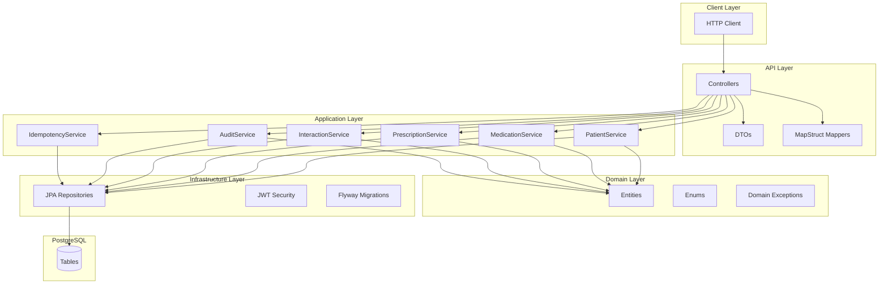
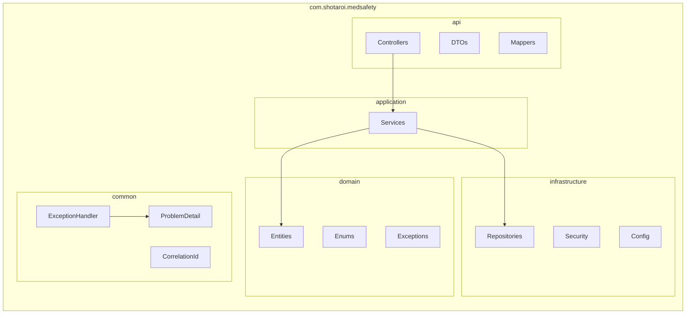
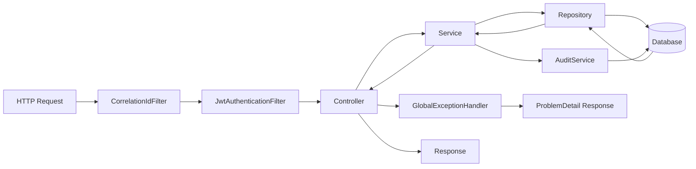
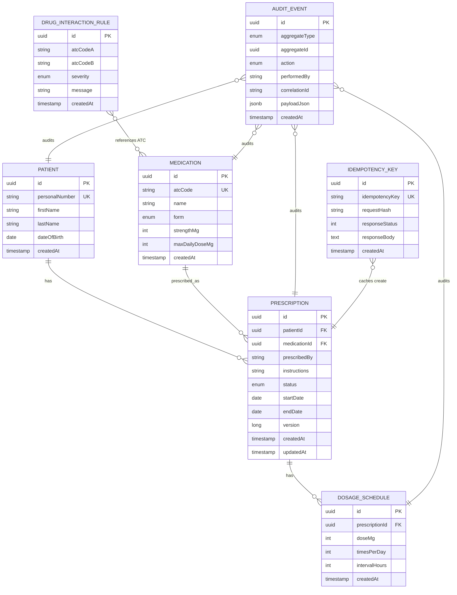
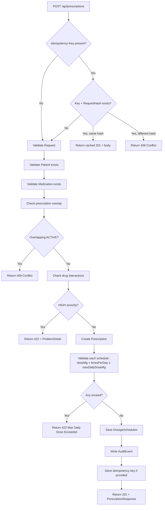
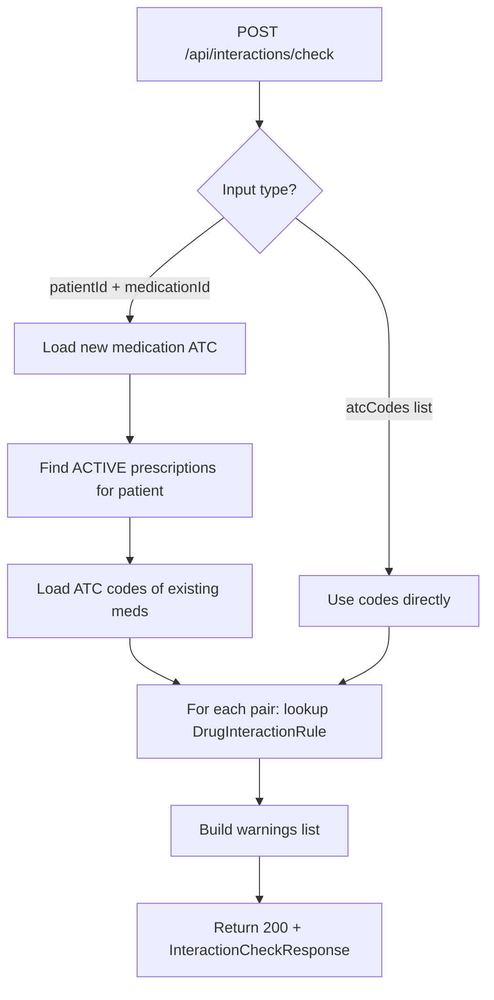
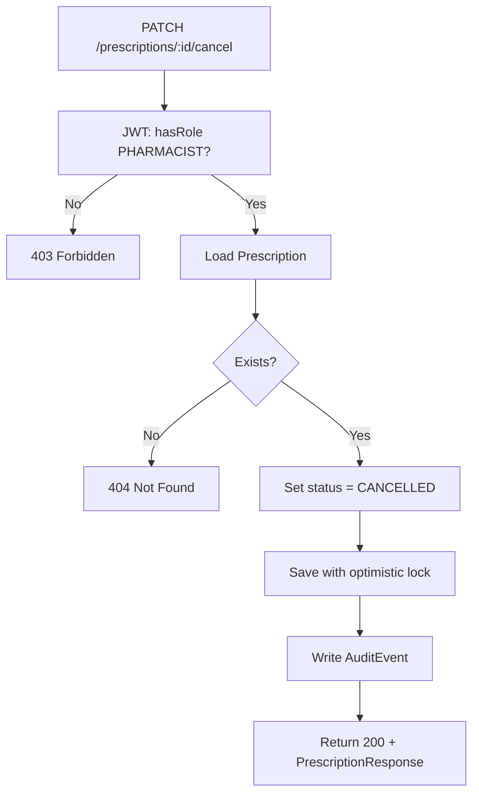
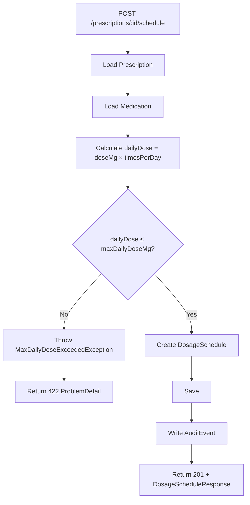
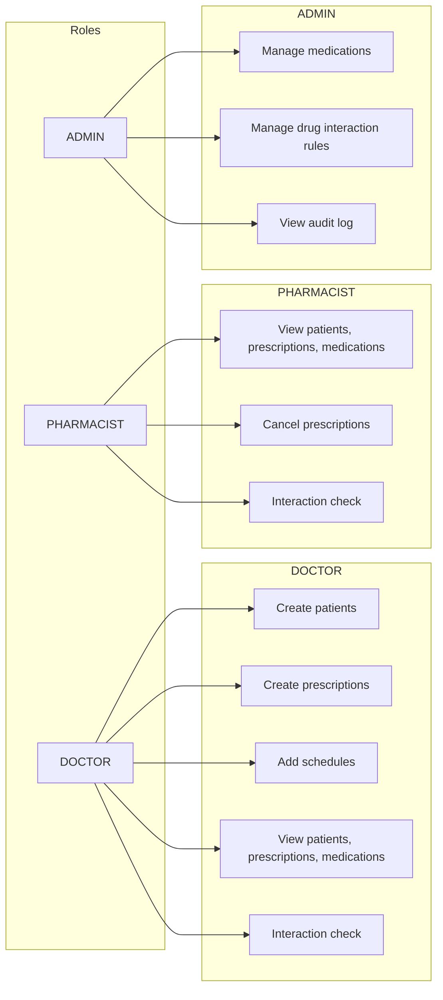

# Medication Safety & Prescription Management System

A production-style Spring Boot REST API for managing patients, medications, prescriptions, and dosing schedules. Built with healthcare-grade safety rules, full audit trails, and role-based security—designed to demonstrate enterprise backend architecture suitable for medtech and regulated domains.

---

## Table of Contents

- [Project Overview](#project-overview)
- [Architecture](#architecture)
- [Domain Model](#domain-model)
- [Request Flows](#request-flows)
- [Safety Rules](#safety-rules)
- [Tech Stack](#tech-stack)
- [Quick Start](#quick-start)
- [API Examples](#api-examples)
- [Testing](#testing)
- [Configuration](#configuration)
- [Future Work](#future-work)

---

## Project Overview

This system manages the lifecycle of prescriptions and dosing schedules while enforcing patient-safety constraints:

- **Validation**: Dose limits, schedule constraints, prescription overlap rules
- **Drug interactions**: Detection and blocking of high-severity interactions
- **Audit trail**: Append-only event log for traceability (who changed what, when)
- **Security**: JWT authentication with role-based access (Doctor, Pharmacist, Admin)
- **Idempotency**: Safe retries for prescription creation via `Idempotency-Key` header

The design emphasizes **traceability**, **immutability** of audit events, **careful validation**, and **clear domain boundaries**—patterns common in real healthcare systems.

---

## Architecture

### High-Level Layered Architecture



### Package Structure



### Request Processing Pipeline



---

## Domain Model

### Entity Relationship Diagram



### Domain Concepts

| Entity | Purpose |
|--------|---------|
| **Patient** | Demographics; identified by `personalNumber` (Swedish personnummer format) |
| **Medication** | Drug catalog with ATC code, form, strength, and `maxDailyDoseMg` safety limit |
| **Prescription** | Links patient + medication; has status (ACTIVE/CANCELLED/COMPLETED), dates, optimistic locking |
| **DosageSchedule** | Per-prescription dosing: `doseMg`, `timesPerDay`, optional `intervalHours` |
| **DrugInteractionRule** | Pairs of ATC codes with severity (LOW/MEDIUM/HIGH) and message |
| **AuditEvent** | Append-only log: aggregate type/id, action, performer, correlation ID, JSON payload |
| **IdempotencyKey** | Stores request hash + response for idempotent prescription creation |

---

## Request Flows

### Prescription Creation Flow (with Idempotency)



### Drug Interaction Check Flow



### Cancel Prescription Flow (Pharmacist)



### Add Dosage Schedule Flow (Max Daily Dose Validation)



---

## Safety Rules

### Safety Rules Decision Flow

```mermaid
flowchart TD
    subgraph PrescriptionCreate["On Prescription Create"]
        A1[Validate patient exists] --> A2[Validate medication exists]
        A2 --> A3[Check overlap: same patient + same med + ACTIVE]
        A3 --> A4{Overlap?}
        A4 -->|Yes| A5[409 Conflict]
        A4 -->|No| A6[Check interactions vs active prescriptions]
        A6 --> A7{HIGH severity?}
        A7 -->|Yes| A8[422 Block]
        A7 -->|No| A9[Continue with warnings]
    end

    subgraph ScheduleCreate["On Schedule Create/Add"]
        B1[Get medication.maxDailyDoseMg] --> B2[Calculate doseMg × timesPerDay]
        B2 --> B3{≤ maxDailyDoseMg?}
        B3 -->|No| B4[422 Max Daily Dose Exceeded]
        B3 -->|Yes| B5[Save schedule]
    end

    subgraph Idempotency["On Idempotency-Key"]
        C1[Hash request body] --> C2{Key exists?}
        C2 -->|No| C3[Process & store]
        C2 -->|Yes| C4{Hash matches?}
        C4 -->|Yes| C5[Return cached response]
        C4 -->|No| C6[409 Idempotency Conflict]
    end
```



### Rule Summary

| Rule | Trigger | Action |
|------|---------|--------|
| **Max daily dose** | Create/update dosage schedule | `dailyDoseMg = doseMg × timesPerDay` must be ≤ `medication.maxDailyDoseMg`; else 422 |
| **Prescription overlap** | Create prescription | No two ACTIVE prescriptions for same patient + medication with overlapping dates; else 409 |
| **Drug interactions** | Create prescription | Check vs active prescriptions; HIGH blocks (422); LOW/MEDIUM returned as warnings |
| **Audit** | Any create/update/cancel | Append-only `AuditEvent` with aggregate, action, performer, correlation ID |
| **Idempotency** | POST /prescriptions with header | Same key + same body → cached response; same key + different body → 409 |

---

## Tech Stack

| Category | Technology |
|----------|------------|
| **Language** | Java 21 |
| **Framework** | Spring Boot 3.2.x |
| **Database** | PostgreSQL 16 |
| **Migrations** | Flyway |
| **ORM** | Spring Data JPA (Hibernate) |
| **Security** | Spring Security, JWT (jjwt) |
| **Validation** | Jakarta Bean Validation |
| **Mapping** | MapStruct |
| **API Docs** | OpenAPI 3 / springdoc |
| **Testing** | JUnit 5, MockMvc, H2 / Testcontainers |

---

## Quick Start

### Prerequisites

- Java 21 (or 17+)
- Maven 3.8+
- Docker (for local Postgres)

### 1. Start PostgreSQL

```bash
docker-compose up -d
```

### 2. Run the Application

```bash
mvn spring-boot:run
```

### 3. Get a JWT Token

```bash
# Doctor token
TOKEN=$(curl -s -X POST "http://localhost:8080/api/auth/token?user=doctor&role=DOCTOR" | jq -r '.token')

# Pharmacist token
PHARM_TOKEN=$(curl -s -X POST "http://localhost:8080/api/auth/token?user=pharmacist&role=PHARMACIST" | jq -r '.token')

# Admin token
ADMIN_TOKEN=$(curl -s -X POST "http://localhost:8080/api/auth/token?user=admin&role=ADMIN" | jq -r '.token')
```

---

## API Examples

### Create Patient (DOCTOR)

```bash
curl -X POST http://localhost:8080/api/patients \
  -H "Authorization: Bearer $TOKEN" \
  -H "Content-Type: application/json" \
  -H "X-Correlation-Id: req-001" \
  -d '{
    "personalNumber": "19900101-1234",
    "firstName": "Anna",
    "lastName": "Andersson",
    "dateOfBirth": "1990-01-01"
  }'
```

### Create Medication (ADMIN)

```bash
curl -X POST http://localhost:8080/api/medications \
  -H "Authorization: Bearer $ADMIN_TOKEN" \
  -H "Content-Type: application/json" \
  -d '{
    "atcCode": "N05AH03",
    "name": "Clozapine",
    "form": "TABLET",
    "strengthMg": 25,
    "maxDailyDoseMg": 100
  }'
```

### Create Prescription (DOCTOR) with Idempotency

```bash
curl -X POST http://localhost:8080/api/prescriptions \
  -H "Authorization: Bearer $TOKEN" \
  -H "Content-Type: application/json" \
  -H "Idempotency-Key: presc-$(uuidgen)" \
  -d '{
    "patientId": "<PATIENT_UUID>",
    "medicationId": "<MEDICATION_UUID>",
    "prescribedBy": "Dr. Smith",
    "instructions": "Take once daily at bedtime",
    "startDate": "2025-02-27",
    "endDate": "2025-05-27",
    "schedules": [
      {"doseMg": 25, "timesPerDay": 1, "intervalHours": 24}
    ]
  }'
```

### Add Dosage Schedule (DOCTOR)

```bash
curl -X POST http://localhost:8080/api/prescriptions/{prescriptionId}/schedule \
  -H "Authorization: Bearer $TOKEN" \
  -H "Content-Type: application/json" \
  -d '{"doseMg": 25, "timesPerDay": 2, "intervalHours": 12}'
```

### Cancel Prescription (PHARMACIST)

```bash
curl -X PATCH http://localhost:8080/api/prescriptions/{prescriptionId}/cancel \
  -H "Authorization: Bearer $PHARM_TOKEN"
```

### Check Drug Interactions (DOCTOR/PHARMACIST)

```bash
# By patient + medication
curl -X POST http://localhost:8080/api/interactions/check \
  -H "Authorization: Bearer $TOKEN" \
  -H "Content-Type: application/json" \
  -d '{"patientId": "<UUID>", "medicationId": "<UUID>"}'

# By ATC codes
curl -X POST http://localhost:8080/api/interactions/check \
  -H "Authorization: Bearer $TOKEN" \
  -H "Content-Type: application/json" \
  -d '{"atcCodes": ["N05AH03", "N06AB06"]}'
```

### Query Audit Log (ADMIN)

```bash
curl "http://localhost:8080/api/audit?aggregateType=PRESCRIPTION&aggregateId=<UUID>&page=0&size=20" \
  -H "Authorization: Bearer $ADMIN_TOKEN"
```

---

## Role-Based Access



| Role | Permissions |
|------|-------------|
| **DOCTOR** | Create patients, prescriptions, schedules; view patients, prescriptions, medications; interaction check |
| **PHARMACIST** | View patients, prescriptions, medications; cancel prescriptions; interaction check |
| **ADMIN** | Manage medications, drug interaction rules; view audit log |

---

## Testing

```bash
# All tests (H2 in-memory)
mvn test

# Specific integration tests
mvn test -Dtest=PrescriptionIntegrationTest,OverlapIntegrationTest
```

| Test | Verifies |
|------|----------|
| **PrescriptionIntegrationTest** | Max daily dose returns 422; idempotency returns cached response |
| **OverlapIntegrationTest** | Duplicate overlapping prescription returns 409 |

Tests use H2 by default. For PostgreSQL via Testcontainers, extend `IntegrationTestBasePostgres` (requires Docker).

---

## Configuration

| Property | Description |
|----------|-------------|
| `spring.datasource.url` | JDBC URL (default: `jdbc:postgresql://localhost:5432/medsafety`) |
| `app.jwt.secret` | JWT signing key (min 256 bits); set `JWT_SECRET` in production |
| `app.jwt.expiration-ms` | Token validity (default: 24h) |

---

## API Documentation

- **Swagger UI**: http://localhost:8080/swagger-ui.html
- **OpenAPI JSON**: http://localhost:8080/api-docs

---

## Future Work

- **Spring WebFlux** for the interaction-check endpoint (reactive, non-blocking)
- **Kafka** for audit event streaming and downstream consumers
- **Cloud deployment** (Kubernetes, managed DB, secrets management)
- **HL7 FHIR** integration for interoperability
- **Rate limiting** and API gateway

---

## License

MIT
